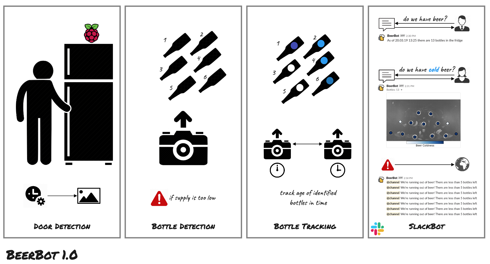

# BeerBot
[](https://github.com/KI-labs/BeerBot/master/LICENSE)

This repository is the central location for all things related to the beloved **BeerBot**.

Tread _carefully_ since this is an extremely important project within [KI labs](https://ki-labs.com/).


# Features

BeerBot is a slackbot capable of the following:

- checking beer (or bottled beverages) in the fridge
- identify and analyze whether bottled beverages are *cold*
- automatically alert when beer is running low

# Processing Pipeline



# Installation 

PlantBot can be installed by cloning this repo and its python requirements.

```bash
$ pip3 install -r requirements.txt
```

# Configuration

Minimal configuration with a `.envrc` file based on `.envrc.template` is required in order to link with Slack.

- build a [slackbot](https://api.slack.com/bot-users)

```text
SLACK_OAUTH_TOKEN=
SLACK_BOT_OAUTH_TOKEN=
CHANNEL=
LISTEN_DELAY=1
ALERT_DELAY=10
MIN_BEER_THRESHOLD=5
DATA_DIR="/home/pi/BeerBot/data"
TZ="Europe/Berlin"
```

# Deployment

There are two scripts for running the BeerBot engine.

- `./slackbot_alert.py`
  - responsible for alerting when beer supply is critically low
- `./slackbot_listener.py`
  - responsible for listening to when users want beer supply or coldness information

These processes are deployed with supervisor in `./supervisor/*.conf`, see [this](http://supervisord.org/installing.html) for installation and setup.
